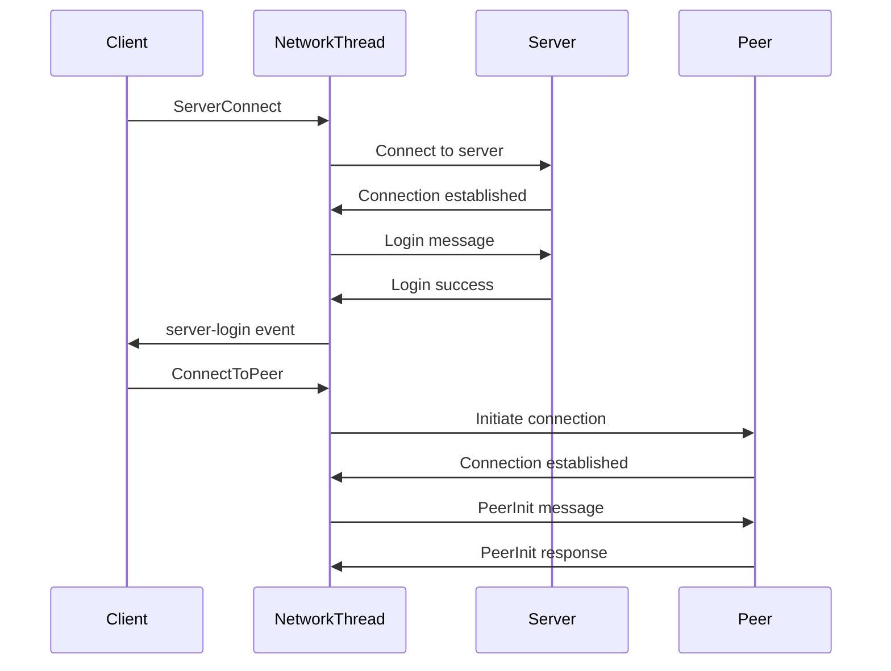

The `slskproto` module implements the Soulseek peer-to-peer network protocol, handling connections, message passing, and distributed network operations.

## NetworkThread Class

Manages all network communications in a dedicated thread.

### Class Attributes

<ParamField path="MAX_SOCKETS" type="int" default="512-2048">
  Maximum number of concurrent socket connections (platform-dependent)
</ParamField>

<ParamField path="CONNECTION_MAX_IDLE" type="int" default="60">
  Maximum idle time in seconds before closing peer connections
</ParamField>

<ParamField path="USER_ADDRESS_TTL" type="int" default="1800">
  Time-to-live for cached user addresses (30 minutes)
</ParamField>

<ParamField path="MAX_INCOMING_MESSAGE_SIZE_LARGE" type="int" default="469762048">
  Maximum size for large incoming messages (448 MiB)
</ParamField>

### Methods

#### start()

```python
def start(self)
```

Starts the network thread. Automatically called during core initialization.

<Note>
The network thread runs continuously, handling all socket I/O operations in a non-blocking manner using a selector.
</Note>

## Connection Classes

### Connection

Base class for network connections.

<ParamField path="sock" type="socket">
  Socket object
</ParamField>

<ParamField path="addr" type="tuple">
  Address as (ip, port)
</ParamField>

<ParamField path="in_buffer" type="bytearray">
  Incoming data buffer
</ParamField>

<ParamField path="out_buffer" type="bytearray">
  Outgoing data buffer
</ParamField>

<ParamField path="is_established" type="bool">
  Whether connection is fully established
</ParamField>

### ServerConnection

Represents a connection to the Soulseek server.

<ParamField path="login" type="tuple">
  Login credentials as (username, password)
</ParamField>

### PeerConnection

Represents a connection to another peer.

<ParamField path="init" type="PeerInit">
  Peer initialization message
</ParamField>

<ParamField path="pierce_token" type="int">
  Token for indirect connection requests
</ParamField>

## NetworkInterfaces Class

Handles network interface detection and binding.

### Methods

#### get_interface_addresses()

```python
@classmethod
def get_interface_addresses(cls)
```

Returns a dictionary of network interface names and IP addresses.

<ResponseField name="interfaces" type="dict">
  Dictionary mapping interface names to IP addresses
</ResponseField>

<CodeGroup>
```python Example: Get Network Interfaces
from pynicotine.slskproto import NetworkInterfaces

interfaces = NetworkInterfaces.get_interface_addresses()
for name, ip in interfaces.items():
    print(f"{name}: {ip}")
```
</CodeGroup>

#### bind_to_interface()

```python
@classmethod
def bind_to_interface(cls, sock, interface_name, address)
```

Binds a socket to a specific network interface.

<ParamField path="sock" type="socket">
  Socket to bind
</ParamField>

<ParamField path="interface_name" type="str">
  Name of the network interface
</ParamField>

<ParamField path="address" type="str">
  IP address of the interface
</ParamField>

## Message Processing

The network thread processes three types of messages:

### Server Messages

Messages exchanged with the central Soulseek server.

<Expandable title="Server Message Examples">
  - `Login` - Server authentication
  - `SetWaitPort` - Announce listening port
  - `GetPeerAddress` - Request peer's IP address
  - `WatchUser` - Subscribe to user status updates
  - `JoinRoom` - Join a chat room
  - `FileSearch` - Initiate a search
</Expandable>

### Peer Messages

Messages exchanged directly with other peers.

<Expandable title="Peer Message Examples">
  - `PeerInit` - Initialize peer connection
  - `SharedFileListRequest` - Request user's file list
  - `FileSearchResponse` - Search results
  - `TransferRequest` - Request file transfer
  - `QueueUpload` - Queue a file for upload
</Expandable>

### Distributed Messages

Messages propagated through the distributed network for searches.

<Expandable title="Distributed Message Examples">
  - `DistribSearch` - Distributed search request
  - `DistribBranchLevel` - Report branch level
  - `DistribBranchRoot` - Report branch root
</Expandable>

## Connection Flow



## Performance Characteristics

<Note>
The network thread uses non-blocking I/O with a selector for efficient handling of multiple concurrent connections:

- Processes ~20-240 events per second depending on activity
- Supports up to 512-2048 concurrent connections
- TCP keepalive ensures stale connections are detected
- Automatic connection timeout after 60 seconds of inactivity
</Note>

<CodeGroup>
```python Example: Send Server Message
from pynicotine.core import core
from pynicotine.slskmessages import WatchUser

# Subscribe to user status updates
core.send_message_to_server(WatchUser("username"))
```

```python Example: Send Peer Message
from pynicotine.core import core
from pynicotine.slskmessages import SharedFileListRequest

# Request a user's shared files
core.send_message_to_peer("username", SharedFileListRequest())
```
</CodeGroup>
